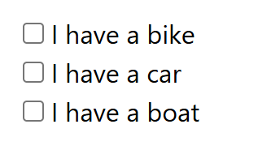

# Checkbox Field

Checkbox fields are used for multiple-selection options in web forms, where users can choose one or more options from a group of independent choices. They provide various configuration options for optimal checkbox interaction behavior.




## Basic Configuration

### Field Properties

| Property                 | Description                               | Example                              |
| ------------------------ | ----------------------------------------- | ------------------------------------ |
| **Field Name**           | Unique identifier for the field           | `newsletter`, `interests`, `terms`   |
| **Field Type**           | Set to **Checkbox** for checkbox elements | `Checkbox`                           |
| **Field Selector Type**  | Method to locate the field element        | `Selector`, `Id`, `XPath`            |
| **Field Selector Query** | Unique address to locate the field        | `input[name="newsletter"]`, `#terms` |
| **Field Value**          | Data source for checkbox state            | Excel column or default value        |

## Checkbox Field Settings

### ☑️ Checkbox State Behavior

Configure how checkboxes are checked/unchecked based on Excel data values.

**Core Behavior:**

- **Excel Value Priority** - Checkbox state depends on Excel column value
- **Checked State** - Checkbox is checked when Excel value is not empty
- **Unchecked State** - Checkbox is unchecked when Excel value is "unchecked"

**Configuration:**

- **Toggle Switch**: Enable/disable checkbox state control
- **Excel Value Check**: System checks Excel column for state values
- **State Action**: Checkbox state changes based on Excel value

**Example Scenarios:**

```
Excel Column Value: "checked" → Checkbox gets checked
Excel Column Value: "unchecked" → Checkbox gets unchecked
Excel Column Value: "" (empty) → Checkbox remains unchecked
Excel Column Value: "yes" → Checkbox gets checked
Excel Column Value: "no" → Checkbox gets unchecked
```

---

### ⏳ Element Detection Settings {#element-detection-settings}

Configure how the extension waits for and interacts with checkbox elements.

#### Wait until element is found in the page

- **Purpose**: Ensures checkbox exists in DOM before interaction
- **Use Case**: Dynamic content, AJAX-loaded checkboxes
- **Configuration**: Toggle ON/OFF

#### Wait until element is visible in the page

- **Purpose**: Ensures checkbox is both found and visible
- **Use Case**: Hidden checkboxes, CSS visibility controls
- **Configuration**: Toggle ON/OFF

### ⚡ Trigger Javascript Event {#javascript-event-triggering}

Configure JavaScript events to be triggered on the checkbox element.

**Supported Events:**

- **change** - Triggers when checkbox state changes
- **click** - Triggers when checkbox is clicked
- **focus** - Triggers when checkbox receives focus
- **blur** - Triggers when checkbox loses focus
- **input** - Triggers on checkbox interaction

## Checkbox State Handling

### Checked Values

- **"checked"** - Checkbox gets checked
- **"yes"** - Checkbox gets checked
- **"no"** - Checkbox gets checked
- **"true"** - Checkbox gets checked
- **"1"** - Checkbox gets checked
- **Any non-empty value** - Checkbox gets checked

### Unchecked Values

- **"unchecked"** - Checkbox gets unchecked
- **"" (empty)** - Checkbox remains unchecked

## Excel Value Configuration

### Text Values

```
Excel Column Value: "yes" → Checkbox checked
Excel Column Value: "no" → Checkbox checked
Excel Column Value: "checked" → Checkbox checked
Excel Column Value: "unchecked" → Checkbox unchecked
Excel Column Value: "" → Checkbox unchecked
```

## Troubleshooting {#troubleshooting}

### Checkbox Not Changing State

- Check selector accuracy
- Verify element visibility
- Test with different selectors
- Check Excel value format

## Next Steps

- [Field Types](/documentation/field-types) - Learn about different field types
- [Field Response Actions](/documentation/field-types/field-response-action) - Configure response behaviors
- [Variables](/documentation/variable) - Use variables in field settings
- [Site Settings](/documentation/site/site-settings) - Configure site-wide settings
