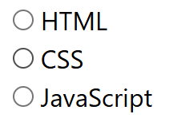

# Radio Field

Radio fields are used for single-selection options in web forms, where users can choose one option from a group of mutually exclusive choices. They provide various configuration options for optimal radio button interaction behavior.



## Basic Configuration

### Field Properties

| Property                 | Description                              | Example                            |
| ------------------------ | ---------------------------------------- | ---------------------------------- |
| **Field Name**           | Unique identifier for the field          | `gender`, `paymentMethod`, `size`  |
| **Field Type**           | Set to **Radio** for radio button groups | `Radio`                            |
| **Field Selector Type**  | Method to locate the field element       | `Selector`, `Id`, `XPath`          |
| **Field Selector Query** | Unique address to locate the field       | `input[name="gender"]`, `#payment` |
| **Field Value**          | Data source for radio selection          | Excel column or default value      |

## Radio Field Settings

### 📻 Radio Selection Behavior

Configure how radio buttons are selected based on Excel data values.

**Core Behavior:**

- **Excel Value Priority** - Radio selection depends on Excel column value
- **Single Selection** - Only one radio button can be selected at a time
- **Value Matching** - Radio button is selected when its value matches Excel data

**Configuration:**

- **Toggle Switch**: Enable/disable radio button selection
- **Excel Value Check**: System matches Excel column value with radio button values
- **Selection Action**: Radio button is selected when value matches

**Example Scenarios:**

```
Excel Column Value: "male" → Radio button with value "male" gets selected
Excel Column Value: "female" → Radio button with value "female" gets selected
Excel Column Value: "" (empty) → No radio button selected
Excel Column Value: "other" → Radio button with value "other" gets selected
```

---

### 🏷️ Set the attribute name of the field's value {#set-the-attribute-name-of-the-fields-value}

Configure which HTML attribute contains the radio button's value.

**Purpose:**

- **Custom Attribute Support** - Handle cases where value is not in standard `value` attribute
- **Flexible Value Detection** - Support different HTML attribute structures
- **Framework Compatibility** - Work with various frontend frameworks

**Configuration:**

- **Toggle Switch**: "Set the attribute name of the field's value"
- **Attribute Name Input**: Specify the custom attribute name (default: "value")
- **Custom Attributes**: Support for `data-value`, `name`, `label`, etc.

**Common Attribute Examples:**

```
Standard: value="option1"
Custom: data-value="option1"
Custom: data-id="option1"
Custom: label="Option 1"
```

**Use Cases:**

- **Framework Integration** - React, Vue, Angular components
- **Custom Components** - Non-standard HTML structures
- **Data Attributes** - Values stored in data-\* attributes
- **Label-based Selection** - Selection based on label text

---

### ⏳ Element Detection Settings {#element-detection-settings}

Configure how the extension waits for and interacts with radio button elements.

#### Wait until element is found in the page

- **Purpose**: Ensures radio button exists in DOM before interaction
- **Use Case**: Dynamic content, AJAX-loaded radio groups
- **Configuration**: Toggle ON/OFF

#### Wait until element is visible in the page

- **Purpose**: Ensures radio button is both found and visible
- **Use Case**: Hidden radio buttons, CSS visibility controls
- **Configuration**: Toggle ON/OFF

### ⚡ Trigger Javascript Event {#javascript-event-triggering}

Configure JavaScript events to be triggered on the radio button element.

**Supported Events:**

- **click** - Triggers when radio button is clicked
- **focus** - Triggers when radio button receives focus

## Excel Value Handling

### Selection Values

- **"option1"** - Radio button with value "option1" gets selected
- **"option2"** - Radio button with value "option2" gets selected
- **Any matching value** - Radio button with matching value gets selected

### No Selection Values

- **"" (empty)** - No radio button selected
- **null** - No radio button selected
- **"none"** - No radio button selected (if "none" is not an option)

### Invalid Values

- **Non-matching value** - No radio button selected
- **Undefined value** - No radio button selected

## Custom Attribute Configuration

### Standard Value Attribute

```html
<input type="radio" name="gender" value="male" /> Male
<input type="radio" name="gender" value="female" /> Female
```

- **Attribute**: "value"
- **Excel Value**: "male" or "female"

### Data Attribute

```html
<input type="radio" name="size" data-value="small" /> Small
<input type="radio" name="size" data-value="large" /> Large
```

- **Attribute**: "data-value"
- **Excel Value**: "small" or "large"

### Label-based Selection

```html
<label for="red">Red</label>
<input type="radio" name="color" id="red" />

<label for="blue">Blue</label>
<input type="radio" name="color" id="blue" />
```

- **Attribute**: "label" or "textContent"
- **Excel Value**: "Red" or "Blue"

## Troubleshooting {#troubleshooting}

### Radio Button Not Selecting

- Check selector accuracy
- Verify element visibility
- Test with different selectors
- Check Excel value format

### Custom Attribute Issues

- Verify attribute name is correct
- Check attribute value extraction
- Test with different attribute types
- Verify framework compatibility

### Value Matching Problems

- Ensure exact value matching
- Check case sensitivity
- Test with different value formats
- Verify radio group association

### Events Not Triggering

- Verify event selection
- Check JavaScript console for errors
- Test individual events first
- Ensure radio button is focusable

## Next Steps

- [Field Types](/documentation/field-types) - Learn about different field types
- [Field Response Actions](/documentation/field-types/field-response-action) - Configure response behaviors
- [Variables](/documentation/variable) - Use variables in field settings
- [Site Settings](/documentation/site/site-settings) - Configure site-wide settings
