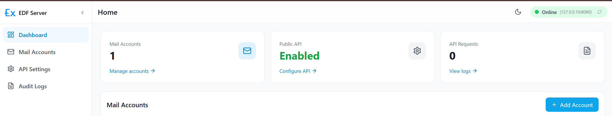

# Local Server {#local-server}

The Local Server feature allows the extension to communicate with a locally hosted server to perform advanced automation tasks, such as email operations and local data processing. 

To configure the server connection to extension, see the [Extension Server Settings](/documentation/settings#extension-server) page.

## 📥 Installation {#installation}

Follow these steps to set up and run the Local Server on your machine.

### Download

| Platform | Download Link | Version |
|----------|---------------|---------|
| **Windows** | [Download EDF Server](/edf-server-v1.0.0.zip) | v1.0.0 |

### How to Run

1.  **Download**: Click the link above to download the `edf-server-v1.0.0.zip` file.
2.  **Extract**: Right-click the downloaded zip file and select **Extract All...** to unzip the contents.
3.  **Run**: Open the extracted folder and double-click the `edf-server.exe` program.
4.  **Command Window**: A CMD (Command Prompt) window will open, indicating the server is running.
5.  **Browser Access**: The server interface will automatically open in your default browser at [http://127.0.0.10:8080/](http://127.0.0.10:8080/).

### API Configuration

To enable communication between the extension and the local server, you must configure the API settings:

1.  **Open API Settings**: Navigate to the server's API settings page: [http://127.0.0.10:8080/settings/api](http://127.0.0.10:8080/settings/api).
2.  **Enable Public API**: Ensure the **Public API** toggle is turned **ON** to allow the extension to access the server.
3.  **API Authorization**: In the **API Authorization** section, you will see the key `X-API-Token`.
4.  **Copy Value**: Click the copy icon next to the **Value** field to copy your authorization token.
5.  **Configure Extension**: Open the extension's **[Settings](/documentation/settings#extension-server)** page, navigate to the **Extension Server** section, and paste the token into the **X-API-Token** field.

:::info
Keep the CMD window open while using the extension's local server features. Closing the window will stop the server.
:::

## 🖥️ Server Interface {#server-interface}

The Local Server dashboard provides several tools to manage your automation environment.

- **Dashboard**: View overall server status, uptime, and active connections.
- **[Mail Accounts](./mail-accounts)**: Add and configure the email accounts that the extension will interact with.
- **API Settings**: Manage API Authorization tokens and toggle public API access.
- **Audit Logs**: Review a detailed history of all requests and actions performed by the server for debugging and security monitoring.

## 🚀 Where to Use {#where-to-use}

The Local Server is utilized by specific field types that require system-level or network-level access for automation tasks.

Currently, the following field types depend on the Local Server:
- **[Get Mail from Local Server](/documentation/field-types/local-server/get-mail-from-local-server)**
- **[Send Mail from Local Server](/documentation/field-types/local-server/send-mail-from-local-server)**

For a complete overview of all available field types, visit the **[Local Server Field Types](/documentation/form-fields/field-types#local-server)** section.

## 🔒 Security Considerations {#security-considerations}

Your privacy and data security are our top priorities. 

- **Local Processing**: All data processed by the Local Server stays on your machine.
- **No Data Collection**: We do not collect, store, or transmit any of your data to external servers. 
- **Privacy First**: The server operates entirely within your local environment, ensuring that sensitive information like email content or automation data never leaves your computer.